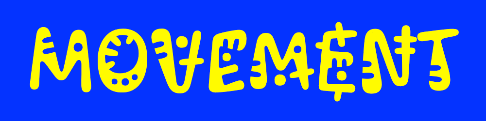
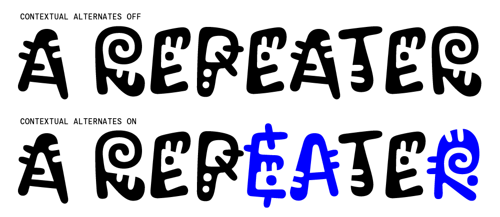

# Kablammo Font Project

## Variable Axes

Kablammo has the following axes:

Axis | Tag | Range | Default | Description
--- | --- | --- | --- | ---
Morph | MORF | 0 to 60 | 1 | Causes elements to move around, and weight to shift

### Axis Definitions

#### `MORF` Morph Axis

The `MORF` axis makes the glyphs dance! The decorative elements fly all over the place along with a shifting weight and contrast. This lends itself particularly well to animations. This can also be used to choose variations of glyphs. There are 4 primary styles for each glyph, but intermediate states of each are possible using the variable axis.

## OpenType Features

### Contextual Alternates `calt`

The contextual alternates can be used to automatically swap alternates when letters appear within 10 glyphs of each other. If a glyph appears more than twice in a 10 glyph span, it will continue to cycle back and forth between two options.

## Software

The following software and scripts were used in the production of this typeface:
* [Glyphs (v3)](https://glyphsapp.com)
* [KablammoScripts](https://github.com/scribbletone/kablammo-scripts)

[KablammoScripts](https://github.com/scribbletone/kablammo-scripts) contains many useful scripts for various parts of the project. Most are not vital, but can help speed the process up. The one exception is the 'Generate Reverse Alts' script. This script should be run before generation of the fonts, especially if changes are made to glyphs that get swapped by contextual alternates. This script copies glyphs and creates their contextual alternate by reversing the order of masters they appear on.

## Design Notes

### Brace layer notes
- Brace layers that share axis values must have the same name, and belong to the same parent master, for fontmake generation. Please use the convention of `{166}`, when naming brace layers. 
- Brace layers must be assigned to the parent master in a way that makes sense for the axis values. For example, axis value of `166` is greater than master `A`(1), and less than `B`(333), so the brace layer `{166}`, should belong to `A`. `{500}` should belong to master `B`.
- Dots should always have a brace layer on entry and exit. Appearance should never span more than half the distance between masters. This is to help speed up the awkward time when they are super small.
- if two or more grouped spots/gashes appear at same time, use brace layer to stagger
- use to stagger dash extension and retraction
- use to avoid crashing elements
- use to keep spots from hitting edges, or coming uncomfortably close to edges
- When staggering elements, try to react to the movement of the stroke’s contrast. For example, if two dots are set to appear, the first one to appear should be on the heaviest end of the stroke. As if bulge is created because the the dot is pushing its way into the stroke.
- Brace layer value should usually be in the halfway point between two masters. 
- These aren’t hard rules. Exceptions can be made to help overall glyph balance, especially with dashes which affect spacing more.

### Rounded corner notes
- If stroke completely crosses through another, keep sharp
- Gashes/Dashes stay sharp
- If a stroke is a core piece of the letterform, like ogonek/cedilla, it should be rounded, unless it completely passes through
- If a core stroke disconnects, and behaves like a dash, it is usually better to leave sharp due to interpolation restrictions. As seen in `A` crossbar.
- If a glyph feels better rounded or sharp, it is ok to break the rules

## Building the fonts

- There is a GitHub workflow/actions triggered on push to `main` branch that will build the fonts and test them using Fontbakery. To inspect the build and test results go to the `Actions` tab in the repository and then to the latest action run.

- To build the fonts locally, follow the instructions next:

### Requirements
- Python 3
- Recent version of [fontmake](https://github.com/googlefonts/fontmake)

### Environment setup 

Optional but recommended method to install dependences. This step has to be done just once, the first time.
1. In terminal `cd` to project directory (tip: type `cd ` then drag folder into terminal for path)
2. run `virtualenv venv` 
3. run `source venv/bin/activate`
4. run `pip install -U -r requirements.txt`

### Generating fonts
1. In terminal `cd` to project directory
2. run `source venv/bin/activate` This step has to be done everytime you work in the project.
3. run `gftools builder sources/config.yml` (this can take a 10-15 minutes)
4. If successful, generated fonts should show up in `fonts` directory under the specified version.